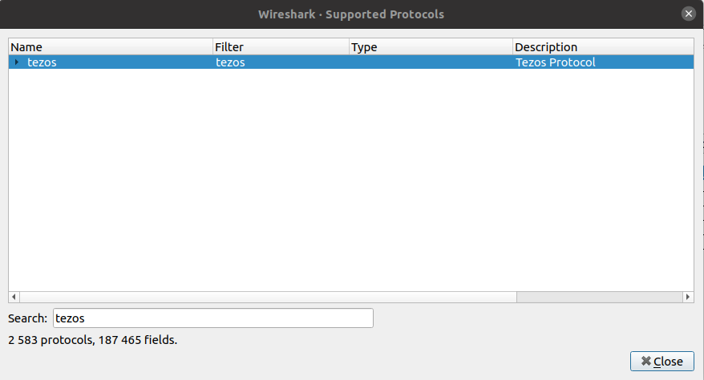
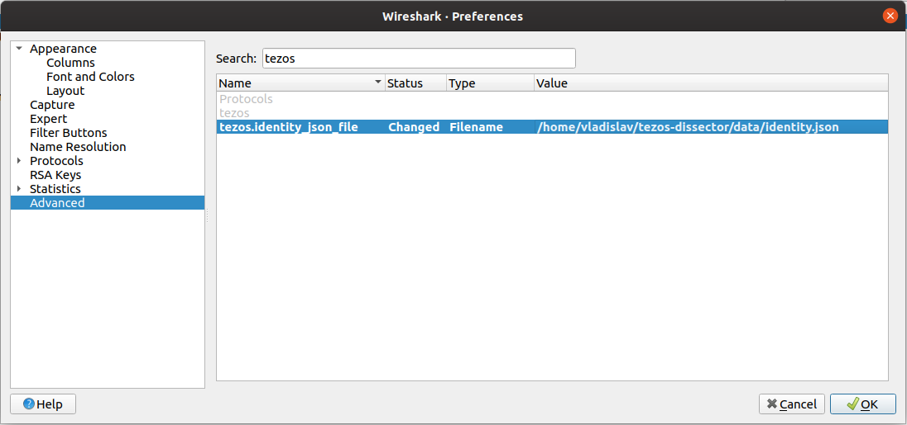

# Tezos dissector

## Build and install on Ubuntu

Install Rust nightly:

```
$ sudo apt install curl
$ curl --proto '=https' --tlsv1.2 -sSf https://sh.rustup.rs | sh
$ rustup install nightly-2020-07-12 && rustup default nightly-2020-07-12
$ source ~/.cargo/env
```

Minimal required version of wireshark is 3.0. If on your ubuntu the version of wireshark is lower add wireshark repository:

```
$ sudo apt install software-properties-common
$ sudo add-apt-repository ppa:wireshark-dev/stable
$ sudo apt update
```

Install wireshark and other build dependencies:

```
$ sudo apt install pkg-config clang make wireshark wireshark-dev termshark
```

Try `pkg-config --cflags wireshark` to check if wireshark headers are accessible. It should print some flags: `-I/.../include/wireshark ...`.

Build the tezos-dissector and install it by running the commands in tezos-dissector directory:

```
$ cargo build --release
$ cargo run -p wireshark-epan-adapter --bin install --release
```

## Build and install on macOS

Install Rust nightly:

```
$ curl --proto '=https' --tlsv1.2 -sSf https://sh.rustup.rs | sh
$ rustup install nightly-2020-07-12 && rustup default nightly-2020-07-12
$ source ~/.cargo/env
```

Install Homebrew if it is not installed:

```
$ /bin/bash -c "$(curl -fsSL https://raw.githubusercontent.com/Homebrew/install/master/install.sh)"
```

Install termshark:

```
$ brew install termshark
```

Check if wireshark accessible for pkg-config: `pkg-config --cflags wireshark` it should print some clang flags. If it does not, check `brew link wireshark` maybe you need to force it with `brew link --overwrite wireshark`. In such case, see what is installed via brew `brew leaves` and try to delete unnecessary packages and fix your environment.

The wireshark installed by brew is dependency of termshark, but it just provides headers for building. To be able to run wireshark UI, install .dmg file from its download page https://www.wireshark.org/download/osx/.

Build the tezos-dissector and install it by running the commands in tezos-dissector directory:

```
$ cargo build --release
$ cargo run -p wireshark-epan-adapter --bin install --release
```

## Install prebuilt plugin

```
$ cargo run -p prebuilt --release
```

It will determine your OS and Wireshark version, and install prebuilt plugin binary.

## Build plugin in docker and install

```
$ cargo run -p prebuilt --release -- -d
```

Required the docker engine to be running.

## Running

#### Checking

Check if the plugin works, go to menu View -> Internals -> Supported Protocols, search 'tezos' it should be in list.



#### Identity

The plugin is useless if the identity file is not provided, specify the file when run the wireshark:

```
wireshark -o tezos.identity_json_file:path/to/identity.json
```

Or you can specify the identity file in UI when wireshark is running. In menu Edit -> Preferences -> Advanced -> tezos.



#### Capturing session

In Ubuntu run the following to get ability to capture traffic.

```
sudo dpkg-reconfigure wireshark-common
sudo usermod -a -G wireshark $USER
```

It is very important to start capturing session before the tezos node run. Also, do not restart node during capturing session. If you need to restart node, stop the capturing session -> restart the node -> start new capturing.
